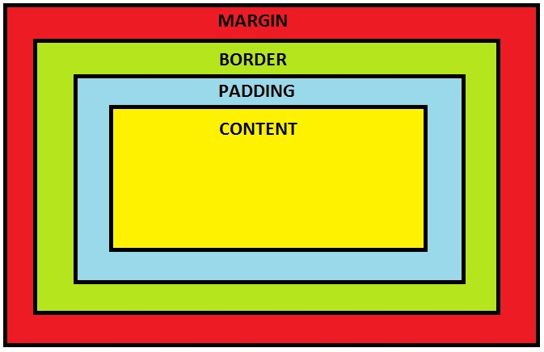
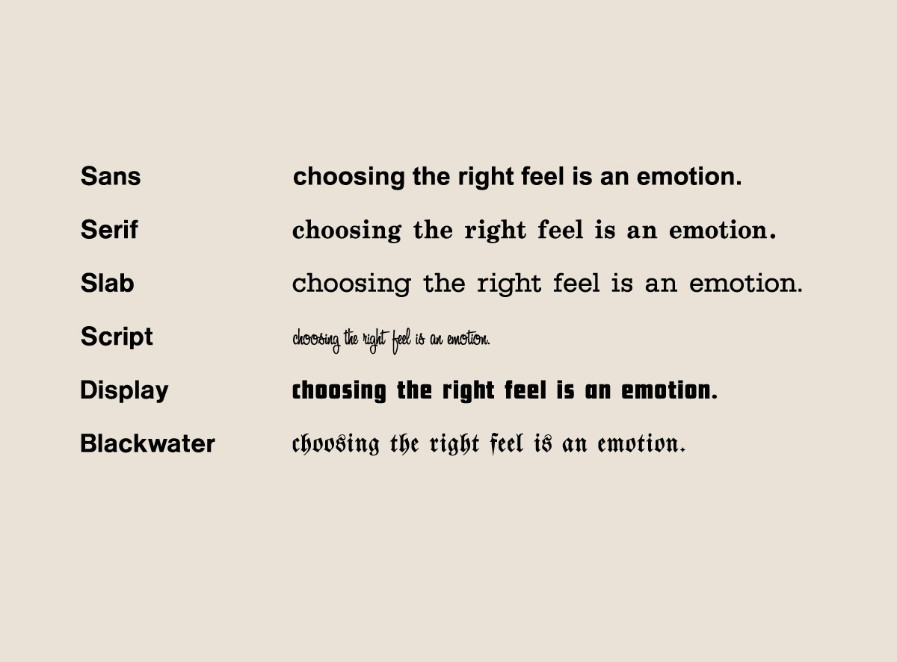
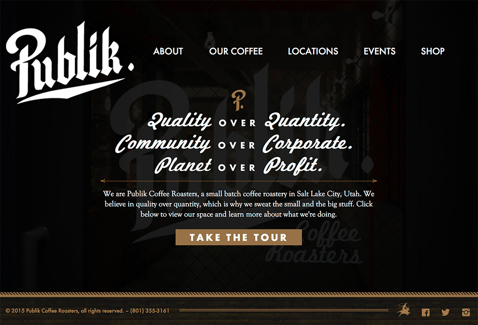
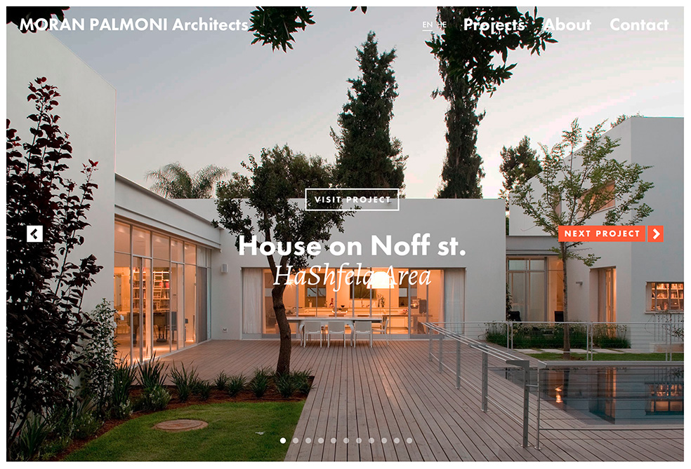
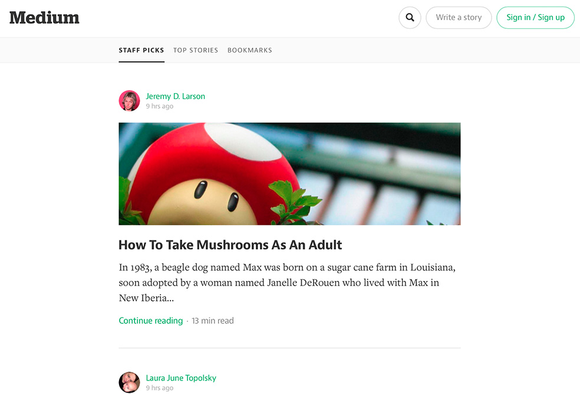
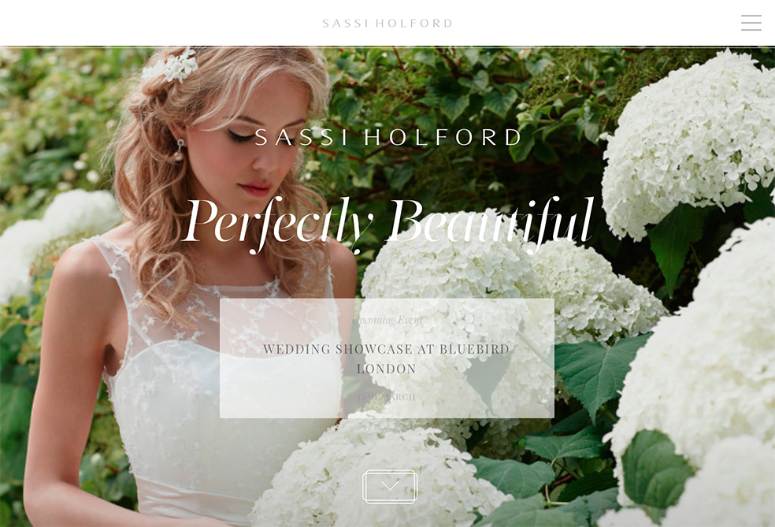

# Debrief II

---

### First hour

## Welcome Back

---

- Lab II - Q&A's
- Portfolio feedback
- Feedback on style tyles & wireframes

---

### Second hour

# Style & Layout Recap

---

# Content vs. style
- *HTML* for content
- *CSS* for style
- Use tags to **markup** elements, not for visual effects
- Use style sheets to define visual effects

---

# `.classes` vs. `#id`
- Classes are **modular** and **reusable**
- IDs are **unique** and should be used for specific purposes only

---

# Group elements with `div` & `span`
- `div` is for grouping text & elements in a **block**
- `span` is for grouping text and elements **inline**
- wrappers/containers
- Choose wisely, prefer semantic code (what is this part of my content *for*?)

---

# The box model


---

# Centering elements


```css
	.yoursite {
		margin-left: auto;
		margin-right: auto;
	}
```

---

# Fluid layouts
- Fluid != responsive!
- Elements automatically organize themselves across the screen
- Use `float: left`

---

# Typography 101

---

- **Fonts** are a universe in itself.
- Some designers spend their life doing mostly font design.
- There are several categories of fonts

---



---
# Webfonts

## Some beautiful type on the web

---



---



---



---



---

# Where to get them

---

## Free:
Usually less weights (bold, italic, etc) and way less good options. Always check for international characters. Some staples like **Open Sans** are all over the web.

- [Google Fonts](http://www.google.com/fonts)
- [Fontsquirrel](http://www.fontsquirrel.com)

---

## Paid:
More unique fonts, made by pros. Lots of weights. Can get very expensive.

- [Adobe Typekit](http://www.typekit.com) (subscription)
- [MyFonts](http://www.myfonts.com) (purchase license)

---

# How to choose

---

- Pick two
- Don't be afraid to combine **serif** + **sans**
- Keep the *mood* consistent
- Only import the font weights you need

---

## Read these:

- [Hoefler & Co](http://www.typography.com/techniques/)
- [The Webfont Combinator](http://font-combinator.com)
- [Typecast](http://typecast.com)

---

## How to use them

---

# 1. Import the fonts

---

## Option A. Google Fonts

1. Choose one or more fonts
2. Click "Add to collection"
3. Go to tab "Use"
4. Select font weights
5. Copy **standard** website code
6. Paste it on your HTML, *before* your main style sheet.

---

# Option B. Host Locally

- Choose and download your fonts
- Go to Fontsquirrel > Webfont Generator
- Follow the instructions and download the "font kit"
- Unzip & copy into a folder (ex: `assets/fonts`)
- Look for the style sheet files. You'll see something like:

---

```css

@font-face {
    font-family: 'open_sansbold';
    src: url('OpenSans-Bold-webfont.eot');
    src: url('OpenSans-Bold-webfont.eot?#iefix') format('embedded-opentype'),
         url('OpenSans-Bold-webfont.woff') format('woff'),
         url('OpenSans-Bold-webfont.ttf') format('truetype'),
         url('OpenSans-Bold-webfont.svg#open_sansbold') format('svg');
    font-weight: normal;
    font-style: normal;

}
```

---

- Add it to the top of your style sheet. You'll need to add one of these for each font weight. Make sure you pay attention to **path**.
- Change the appropriate path to the font file on your structure (`/assets/fonts` in our example)
- Change the **font-family** and **font-weight** values to match what each @font-face is referring to (in our example's case, it should be "Open Sans" and "bold")

---

# 2. Use the font

After you import the font, you can simply use it in your CSS:

```css
p {
	font-family: 'Open Sans';
}
```

---

# Licensing

Any .ttf font can be used as a web font. However, you must pay attention to licensing and make sure you only use fonts on the web which are licensed for such use.

---

# Questions?


---

# BONUS DEMO
## A simple page in 5min with Bootstrap